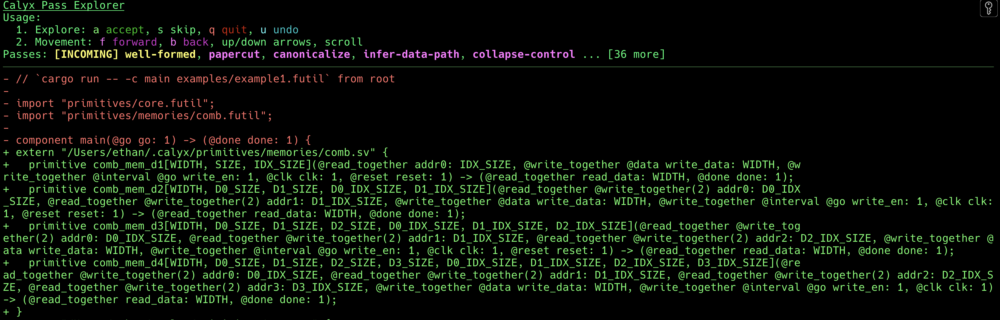
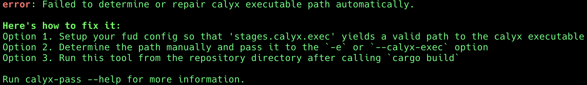

# Visualizing Compiler Passes

Working on the compiler can be daunting, especially when there are lots of
complicated (and simple) passes that turn your original calyx source into
something hardly recognizable.
Sometimes the best way to learn how a pass works (or to debug an existing pass)
is just to run it on code and see what happens.

Enter [`calyx-pass-explorer`](https://github.com/calyxir/calyx/tree/main/tools/calyx-pass-explorer).
It's a command line tool that provides an interactive interface for visualizing
how different passes affect the source code.

> 
> _The above image depicts the tool's interface in v0.0.0.
> As of writing this documentation, it's on v0.2.1._

Check out the [source code](https://github.com/calyxir/calyx/tree/main/tools/calyx-pass-explorer/src) if you're interested.

## Usage

> Take a look at the [user manual](https://github.com/calyxir/calyx/blob/main/tools/calyx-pass-explorer/manual.md) for detailed information.
> This section will serve as a basic overview.

First, we have to get a calyx file to work with.
Let's use this one:

```
import "primitives/core.futil";
import "primitives/memories/comb.futil";

component main(@go go: 1) -> (@done done: 1) {
  cells {
    @external(1) in_mem = comb_mem_d1(32, 1, 32);
    @external(1) out_mem = comb_mem_d1(32, 1, 32);
    i0 = std_reg(32);
  }
  wires {
    group d1 {
      in_mem.addr0 = 32'd0;
      i0.in = in_mem.read_data;
      i0.write_en = 1'b1;
      d1[done] = i0.done;
    }
    static<1> group s2 {
      in_mem.addr0 = 32'd0;
      out_mem.write_data = i0.out;
      out_mem.write_en = 1'b1;
    }
  }
  control {
    seq {
      seq {
        d1;
        s2;
      }
    }
  }
}
```

It's a simple program that reads in a value from the memory `in_mem` into the register
`i0`, and then from `i0` into the memory `out_mem`.
Incidentally, I used this file to test my implementation of the
[`@fast` attribute](https://github.com/calyxir/calyx/pull/2118); I wrote this
tool to help develop it!

We'll first run `calyx-pass-explorer example0.futil`.
You should get something horrific like



> [!TIP]
> If you get this message:
> 
> You should setup `fud` or pass the path explicitly with `-e`, as suggested.
> However, we're going to update this later to look at `fud2` as well because
> `fud` is now officially deprecated.

The first few lines are readable, but after that, there's a lot of calyx
standard library components we don't really care too much about.
What we really want is to focus on what happens to, _e.g._, the `main` component.
To do that, we just pass `-c main` (or `--component main`) as a flag:


That's a lot better, but it's still quite a bit of information.
Let's break it down.

- At the top, we have the instructions.
  You primary use the keyboard to interact with the tool (but you can scroll through the
text with a mouse if there's a lot of it).
- Then, we have the list of passes.
  Yellow passes are incoming passes: these are the ones for which the diff is
shown.
  In other words, we're seeing the result of applying the `well-formed` pass to
  the original input.
  Purple passes are upcoming -- they can be applied after we apply the current
one.
  Green passes are those we've already applied, and gray ones are those we've
skipped.
- Finally, we have the diff of the incoming pass applied to the current code.
  In particular, the code hasn't been edited yet -- it won't be, until we press
  `a` to accept.

### Breakpoints

Often, you're interested in one pass that is far into the set of passes.
There are two options to help you do that:

1. `-b` or `--breakpoint` takes in a pass name and lets you automatically accept
   (see next option) passes until you arrive at the specified pass.
2. `-d` or `--disable-pass` skips a pass when reaching a breakpoint.
   You can pass this option multiple times.

## How it works

The tool creates a temporary directory where it stores the results of applying
passes.
The [`PassExplorer`](https://github.com/calyxir/calyx/blob/main/tools/calyx-pass-explorer/src/pass_explorer.rs) `struct` handles how passes are applied and updates this directory's contents.
I wrote a custom [scrollback buffer](https://github.com/calyxir/calyx/blob/main/tools/calyx-pass-explorer/src/scrollback_buffer.rs) to accommodate the specific its TUI needs.
