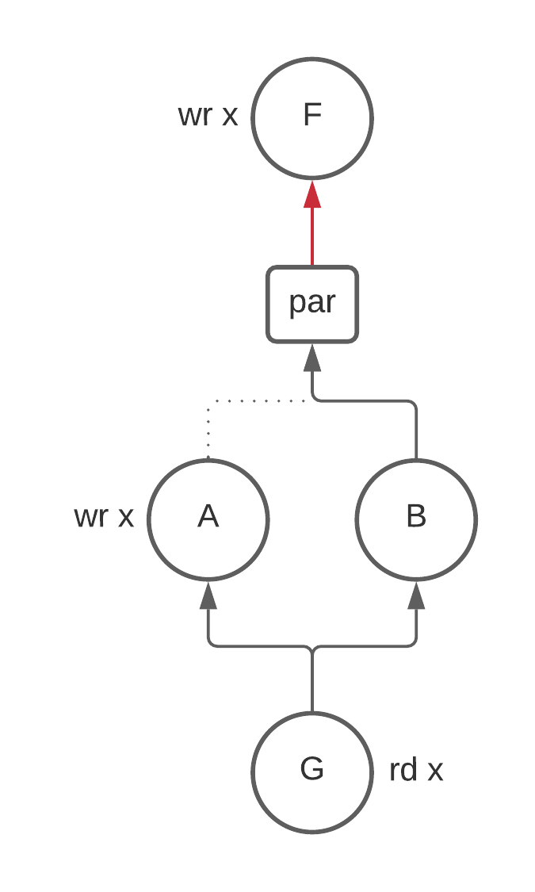
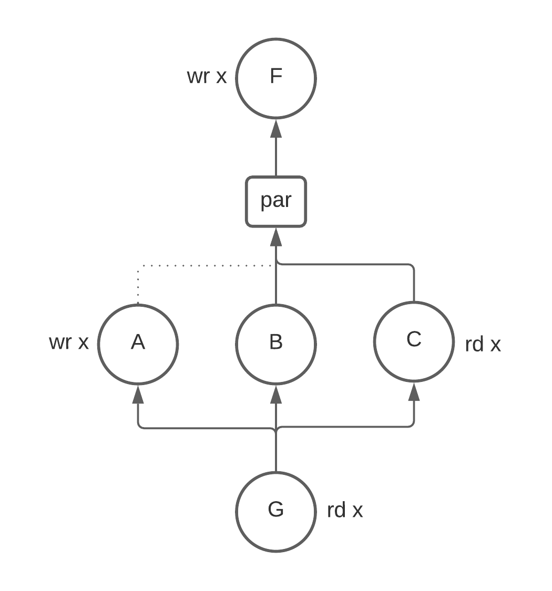

# Dataflow Optimizations
In general, dataflow analysis uses the control and data flow of a program to compute
various properties (liveness, reaching definitions, ...) at each point in a program.

For Calyx, dataflow analyses use the explicit control program and knowledge about
the dataflow of each group to compute properties about each group.

## Basic blocks vs. Groups
Normally, dataflow analyses compute a property at each basic block of a control
flow graph (CFG). Calyx doesn't have a notion of basic blocks, and so Calyx computes
a property at each group in a program.

Because Calyx separates the control flow of a program from the specification of
groups, it's possible for a group to appear multiple times in the control program.
For this reason we compute a property at each group *enable* rather than each group
*definition*. The property at each group *definition* can easily be computed
as the meet over all group enables.

## Dataflow on an AST
Dataflow analyses are typically performed by finding the fixed point
of a set of equations defined at each node of a control flow graph (CFG)
using the [worklist algorithm][].

Because our control AST is little more than just the edges of a [reducible cfg][],
we don't bother to build an explicit CFG and instead perform the
dataflow analysis directly on the AST using Calyx's visitor infrastructure.

### Abstract Algorithm
We model each control statement `s` as a function, `f: p -> p` where `p` is
the type of the property. Control statements that have children define how information
flows between its children.

#### Enable
`f` for `enable A` is similar to the transfer function in standard dataflow analysis. It
uses information from the definition of group `A` to modify the input in some way. For example,
if `p` is the set of live variables, the enable `f` is defined as:
```
f(enable A, inputs) = (inputs - kill(A)) | gen(A)
```

#### Seq
`seq` defines sequential control flow edges between its children.
It is implemented by threading its input through all of its children to produce an output.
```
f(seq { A; B; C; ...; Z; }, inputs) =
     f(A, inputs)
  |> f(B, _)
  |> f(C, _)
  |> ...
  |> f(Z, _)
```
To implement a backwards dataflow analysis, all you need to do is reverse the
order that `seq` pipes inputs to its children:
```
// reverse
f(seq { A; B; C; ...; Z; }, inputs) =
     f(Z, inputs)
  |> ...
  |> f(C, _)
  |> f(B, _)
  |> f(A, _)
```

#### If
`if` passes its inputs to its condition group and then feeds the result of this
to both of its children. The output is the union of the outputs of both of its
children. This is standard.
```
f(if some.port with G { True; } else { False; }, inputs) =
  f(True, f(G, inputs)) | f(False, f(G, inputs))
```

#### While
`while` statements are interesting because the outputs of the body may affect the
input to the body. For this reason, we need to find a fixed point:
```
f(while some.port with G { body; }, inputs) =
  P = inputs;
  loop until P stops changing {
    P = f(body, f(G, inputs))
  }
```

#### Par
Par is the only statement that differs substantially from traditional dataflow because
control flow graphs don't support nodes running in parallel. In other words, there is only
ever one thing executing. However, `par` changes this and allows multiple things to
execute at the same time. Consider the following example where we are computing
the liveness of `x` to see why this is weird:
```
F; // wr x
...
par {
  A; // wr x
  B;
}
G; // rd x
```
Is `x` alive between `X` and the beginning of `par`? The answer is no because we know
that *both* `A` and `B` will run. Therefore the write to `x` in `F` can not be seen by any
group.

At first glance this doesn't seem like a problem. Great, we say, we can just take
the union of the outputs of the children of `par` and call it a day.



This is wrong because `B` doesn't kill `x` and so `x` is alive coming into `B`.
The union preserves this information and results in `x` being alive above `par`.

Taking the set intersection is not quite right here either. Consider adding another group
`C` that reads from `x`.



We have no information about how this read is ordered with the write
to `x` in `A` so we have to assume that `x` is alive above `par`. If we take the intersection
here:

```
  live(A) & live(B) & live(C)
= {} & {x} & {x}
= {}
```
We get the wrong answer. More generally, we can see that union clobbers
any writes and intersection clobbers any reads that happen in the par.

The solution to this problem is solved by passing the `gen` and `kill` sets along
with the `live` sets. Then `par` can set its output to be 
```
(union(live(children)) - union(kill(children))) | union(gen(children))
```

The final tricky bit is thinking about how information flows between siblings in a `par` statement.
Consider again the picture above with three nodes: `A`, `B`, and `C`. Should `x` be live
at `B`? For liveness it turns out to be yes, but bare with me for a second for a thought experiment
and consider the case where we have the guarantee that statements running in parallel can not interact 
with each other. This lets us reorder statements in some cases.
Then there seems to be an information trade-off for how to define the liveness of `x` at `B`:
 - You could say that `x` is dead at `B` because it doesn't see any previous writes to `x`
 and doesn't read from `x`. This implies that you could potentially replace writes to other
 registers with `x`. However, this by itself would cause `x` to be written to twice in parallel.
 You would have to reorder `B` to run before `A`. The takeaway here is that calling `x` dead
 at `B` gives the register reuse pass more information to work with. To compute
 this information `B` needs the `gens` and `kills` from all of its siblings (for the same reason that `par`)
 needed it. This is not particularly hard to implement, but it's worthy of noting.
 - If you say that `x` is live at `B`, then you can never rewrite `B` to use `x` instead
 of some other register, but you also don't have to worry about reordering statements in a `par`.
 
Leaving thought experiment land, in our case we can never reorder statements in a `par` because
siblings may interact with each other in arbitrary ways. For this reason, we must say that `x`
is live at `B`. However, it's not immediately clear to me that this will be true of all dataflow
analyses. That's why I set this thought experiment down in writing.

### Equivalence to worklist algorithm
In the normal worklist algorithm, we add a statement back to the worklist when
its predecessor has changed.

The intuition for why this algorithm is equivalent to worklist algorithm is
that because the only entry into the children for each parent control statement
is the parent control statement itself. The only way that a child statement would
need to be recomputed is if the inputs to the parent need to be recomputed. Anything
above the parent in the tree will take care of this re-computation.

[worklist algorithm]: https://en.wikipedia.org/wiki/Data-flow_analysis#An_iterative_algorithm
[reducible cfg]: https://en.wikipedia.org/wiki/Control-flow_graph#Reducibility
