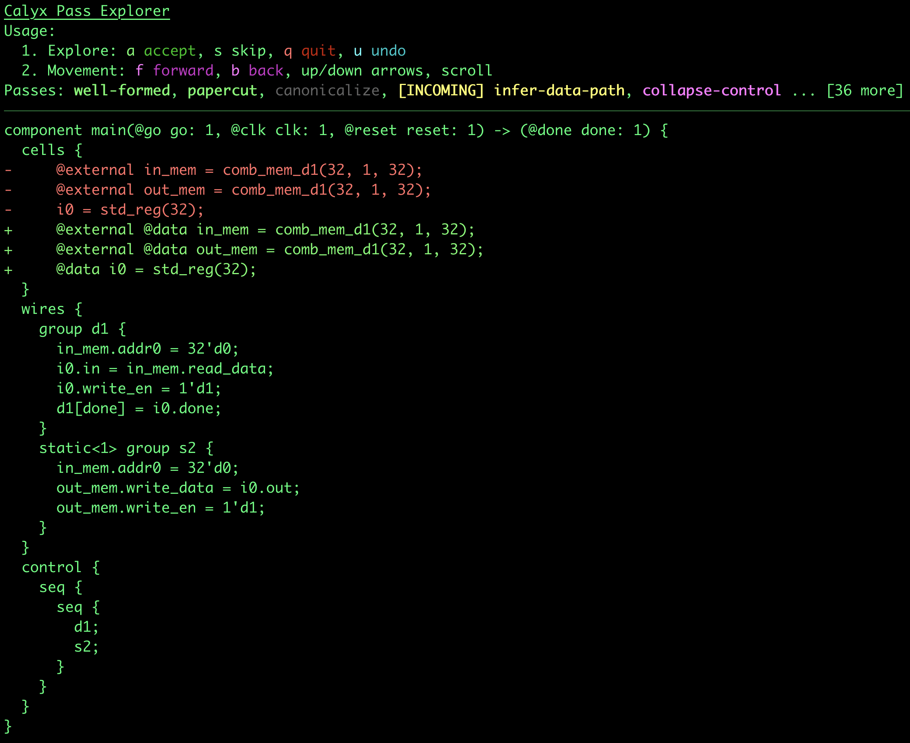

# calyx-pass

`calyx-pass-explorer` is a *pass transformation* explorer for calyx.
You give it an input file and some options, and you can explore how [passes](https://crates.io/crates/calyx-opt) transform the file over time.
It's been immensely useful for me, and I hope it is for you too!


> Above: Running v0.0.0 on [example1.futil](examples/example1.futil).

## Features

- Visualize pass transformations with readable `diff` insertions. By default, it uses `-p all`, but you can provide a different alias. Note: only aliases are supported because it is easy enough to simply run the calyx compiler driver with a single pass.
- Focus on changes localized to one specific component with the `-c` option.
- Set a breakpoint for pass exploration with the `-b` option. You can then use `u` to undo previous passes and explore the changes before and after the pass. Pass passes with `-d` to be skipped before the breakpoint.
- Nearly-arbitrary pass execution with TUI commands. Currently `a`/`s`/`u` (accept/skip/undo) are supported, and `r` (run given pass) is planned.

## Install

Navigate to the `calyx-pass-explorer` directory (e.g., `cd tools/calyx-pass-explorer` from the repository root).
Check the version with
```shell
cargo run -- --version
```

Then, run
```shell
cargo install --path .
```
from the current directory.

## Usage

Please read the short [user manual](manual.md) to learn how to use the CLI and tool.

## Example

```shell
cargo run -- -c main examples/example1.futil
```

## Author

This tool was designed and developed by [Ethan Uppal](https://www.ethanuppal.com).

## Known Issues

- ANSI escape sequences aren't processed correctly -- they need to be parsed and ignored when computing column width.


> Running v0.2.1 on the same example shown previously.
