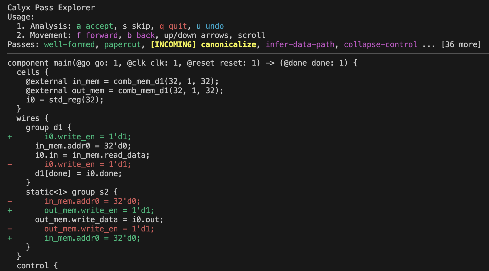

# calyx-pass

`calyx-pass` (name TBD) is a work-in-progress *pass transformation* explorer for calyx.
You give it an input file and some options, and you can explore how passes transform the file over time.

## Features

- Visualize pass transformations with readable diff insertions. By default, it uses `-p all`, but you can provide a different alias.
- Focus on changes localized to one specific component with the `-c` option.
- Set a breakpoint for pass exploration with the `-b` option. You can then use `u` to undo previous passes and explore the changes before and after the pass. Pass passes with `-d` to be skipped before the breakpoint.
- Nearly-arbitrary pass execution with TUI commands. Currently `a`/`s`/`u` (accept/skip/undo) are supported, and `r` (run given pass) is [planned](TODO.md).
- And all those unchecked in [TODO.md](TODO.md) are coming soon!

## Usage

Pass `--help` to view invocation information.
The TUI (terminal user interface, like a GUI but with text) displayed when running the program has instructions for how to use it.
If you do not pass `-e`/`--calyx-exec` with the path to the `calyx` driver executable, it will infer it as follows:

1. It will try to use `fud`'s configuration to piece together the location.
2. If that fails, it will assume you are running it from the calyx root directory having already ran `cargo build`.

## Author

This tool was designed and developed by [Ethan Uppal](https://www.ethanuppal.com).
