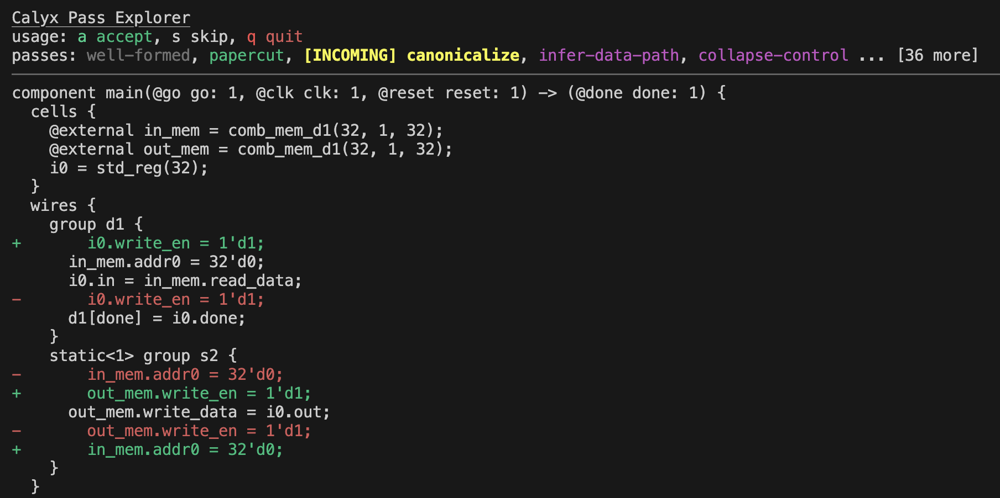

# calyx-pass

`calyx-pass` (name TBD) is a work-in-progress pass explorer for calyx.
This document is a work-in-progress too.



## Features

- Real-time visualization of changes that passes make
- Option to view changes localized to one specific component (pass `-c <name>`/`--component <name>`).
- Those in [TODO.md](TODO.md) are coming soon!

## Usage

Pass `--help` to view invocation information.
The TUI (terminal user interface, like a GUI but with text) displayed when running the program has instructions for how to use it.
If you do not pass `-e`/`--calyx-exec` with the path to the `calyx` driver executable, it will infer it as follows:

1. It will try to use `fud`'s configuration to piece together the location.
2. It will assume you are running it from the calyx root directory having already ran `cargo build`.

## Development

Run `make dev` before starting development and run `make undev` before committing.

## Known Issues

The program currently works by maintaining files and not `calyx_ir` objects, so the pretty-print will produce internal symbols that cannot be reparsed. For example, running `-p simplify-with-control` after `-p cell share` leads to such an issue:

```
Error: Failed to parse `test2.futil`:   --> 83:5
   |
83 |     @NODE_ID(0) seq {
   |     ^---------^
   |
   = Invalid attribute: NODE_ID. All caps attributes are reserved for internal use.
```
